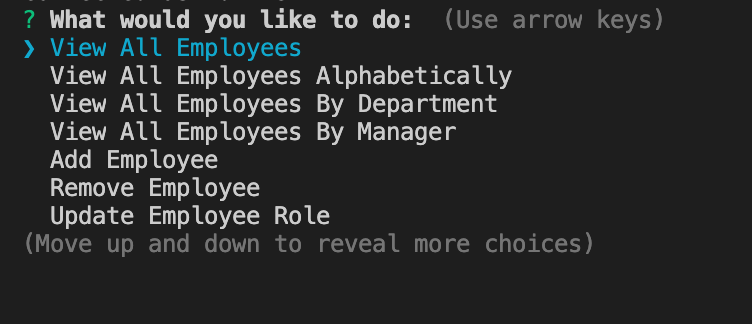

# Employee Management System

## Description 
This program is a CLI designed to allow to the user to view a companany's employees, departments, and roles within those departments.  The user can also, add new employees, update their role or manage or delete employees.  The user can also add new roles or departments.  

This application is built on node.js and uses mySQL to store and interact with all data.  The npm package inquirer is used to allow the user to interact with the command line.  

## Table of Contents
  
* [Installation](#installation)
* [Usage](#usage)
* [Questions](#questions)
  
  
## Installation

### Run the Project Locally
** This project requires node.js so make sure that is installed on your system before doing anything else. **
** Also, this project uses a mySQL database so make sure that is installed.  I would also recommending installing mySQL Workbench so it is easier to populate create and populate the database for this project.  

* Step 1: Navigate to the directory you want to store the project. Clone this your repository to your local computer using the command below. 
```bash
https://github.com/MarkMulligan97/EmployeeManagementSystemV.2.git
```

* Step 2: Use the command line to navigate to the directory that you cloned the project.
Example:
```bash
cd directory/projectdirectory
```

* Step 3: Install the npm package dependencies from the package.json file.
```bash
npm install
```

* Step 4: Change the information in the connection.js file in the config folder so that is corresponds to the correct information to run locally on your machine.  

* Step 5: Start an instance of mySQL on your local machine.

* Step 6: Using either a the command line or GUI (such as mySQL Workbench) to interact with mySQL, create the database required for this project using the schema.sql file.

* Step 7: Populate this database with using the seed.sql file.

* Step 8: After creating the database and populating it, run the program using node with the following command.
```bash
node server.js
```

* Step 9: Once the program is started, use the commandline to respond to the prompts.



Here is an example of the information displayed in one of the tables in the command lines.

 

## Questions
[My Github](https://github.com/MarkMulligan97) || mark.mulligan.jr1@gmail.com

#### How to Contact Me
Feel free to reach out to me if you have any questions about this project.  You can email me using the email listed above or can go to my github page to view my other projects and portfolio.

© Mark Mulligan 2020 All Rights Reserved.